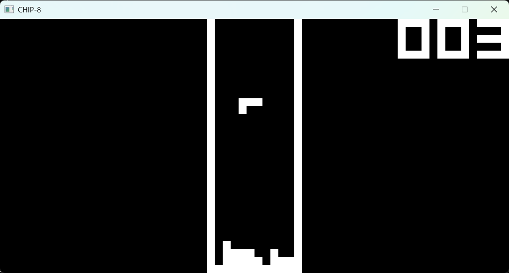
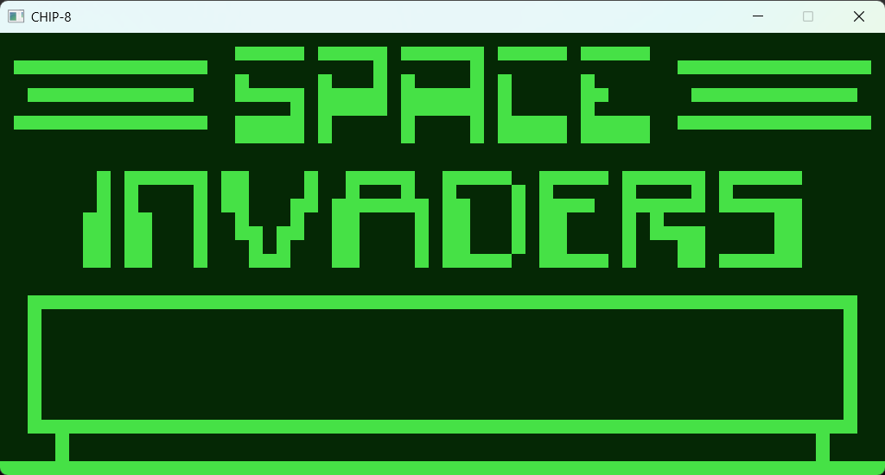

# CHIP-8

An emulator (interpreter) for CHIP-8 programs, written in C.



_Tetris_



_Space Invaders_

## Features
- All relevant opcodes implemented
- Working sound (can choose between sine wave or square wave)
- Customisable color scheme for background and sprites

## Compiling / Running

This project uses the CMake build system.
Clone the repository, then configure and build:

```sh
git clone https://github.com/VarunVF/chip8.git
cd chip8/
mkdir build
cd build
cmake ..
cmake --build .
```

The `roms/` directory has some public domain ROMs that can be used with the emulator.

Run a CHIP-8 ROM, such as one in the `roms/` directory:
```sh
./chip8 roms/BRIX
```
